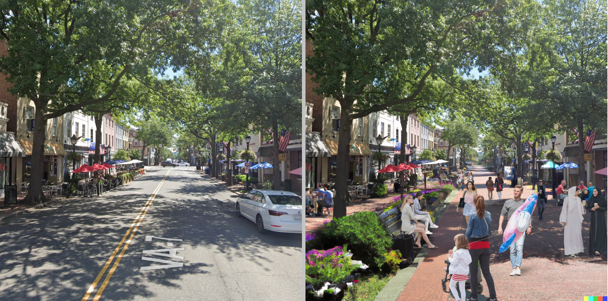
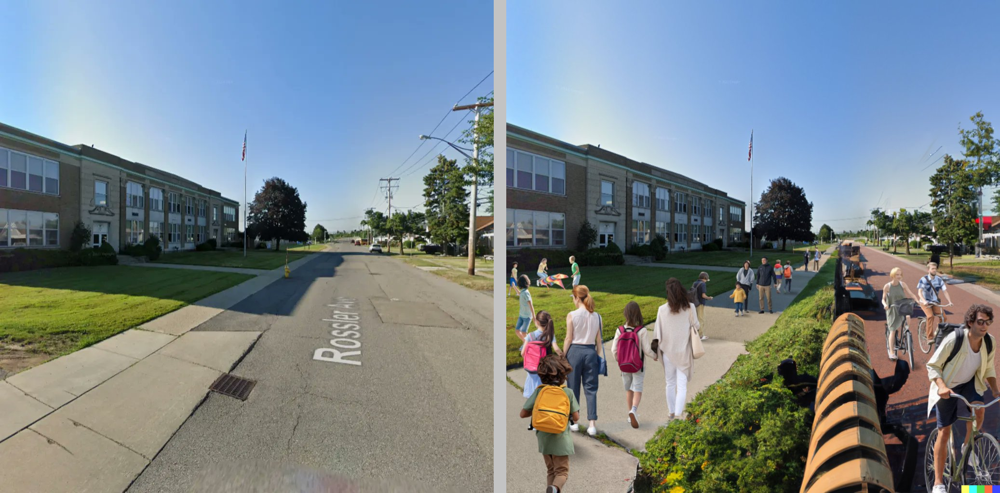
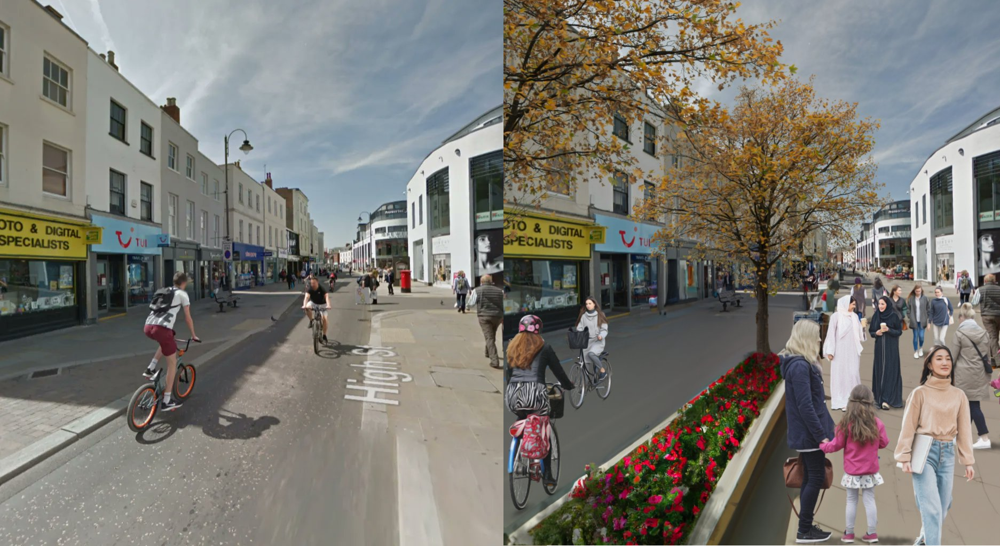

Futurists have long recognized the promise and disruptive potential of artificial intelligence, but there have been many false starts and [AI has developed a reputation for overpromising and underdelivering](https://podcasts.apple.com/gb/podcast/ai-failure-series-overpromising-and-underdelivering/id1279927057?i=1000546421391). Success has been relegated to narrow domains like chess where the task is well-defined, rules are explicit, and the objective is clear. Even in these simplified environments the AI platforms have required teams of engineers working relentlessly to refine and optimize a system of algorithms tailored to the specific task to achieve a notable level of performance. 

This is an example of **Narrow Artificial Intelligence**, AI systems designed for specific tasks like facial recognition. **Artificial General Intelligence** refers to AI that can learn new tasks on its own without being engineered specifically for that task, making them adaptable in ways that mimic humans. Many AI systems like self-driving vehicles would fall somewhere in the middle.  

Deep Blue beating Kosparov in 1997 was a true milestone, but it is less impressive when considering that it took thousands of engineers 50 years and billions of dollars of investment to beat one human brain weighing 3 pounds (granted it took nature 3.7 billion years to design that brain). More so, Deep Blue's success reflected advances in computing power that enabled brute force search more so than adaptive algorithms that "learn". [Deep Blue could explore up to 100 million moves per second](https://spectrum.ieee.org/how-ibms-deep-blue-beat-world-champion-chess-player-garry-kasparov). 

Fast forward another 20 years to 2017 and Google's DeepMind program, which was designed to play Go, [was able to learn chess in just four hours before beating the standing world champion program at the time](https://www.kasparov.com/blog-post/alphazero-ai-beats-champion-chess-program-after-teaching-itself-in-four-hours/). A few years later ChatGPT shocked the world with its ability to write essays, solve problems, author poems, and debug computer programs.   

As we inch closer to an era of artificial general intelligence it is important to understand the strengths and weaknesses of AI as we try to anticipate how it will impact society and how it can be effectively harnessed for good. AI can reliably outperform humans on many more narrow, well-defined tasks like [reading MRI scans to detect cancer](https://www.cancer.gov/news-events/cancer-currents-blog/2022/artificial-intelligence-cancer-imaging). But can it outperform humans on [writing the next country music banger](https://youtu.be/EPs6wdM7S3U)?  

It depends on how we measure performance. Many AI systems are actually quite good at the **creative** component of difficult tasks - combining things in new and interesting ways that surprise and delight humans. For example, having [ChatGPT re-write a lecture on a dry topic as a Seinfeld episode](https://boingboing.net/2022/12/02/openais-chatgpt-is-a-decent-poet-and-seinfeld-show-writer.html) or producing something meaningful from the nonsensical prompt of [writing a bible verse about removing a peanut butter sandwich from a VCR](https://www.springboard.com/blog/news/chatgpt-revolution/) ([results](https://raw.githubusercontent.com/DS4PS/ds4ps.github.io/master/_posts/img/pb-vcr-bible-verse.jpg)). 

Because most novel content generated by AI from prompts is created from pattern-recognition it is _**smartish**_, not _**intelligent**_. It conveys meaning in the same way that clever but lazy undergrad students bullshit their way through difficult writing assignments - repurposing jargon and parroting phrases from the week's reading without truly understanding the material. This is why Stack Overflow banned users from posting coding answers generated from ChatGPT - they sound plausible but are typically wrong. 

As a result, AI can be most effectively deployed by augmenting instead of replacing humans similar to how calculators transformed engineering - making good engineers better by making tedious tasks faster but not really helping bad engineers because speed doesn't matter if you are focusing on the wrong problems. Professions like graphic design and architecture are being transformed by AI algorithms that can generate lots of creative options, but they require astute humans to provide the right prompts and evaluate the quality of outputs. In other words, AI is better at generating ideas than solutions. 

[Better Streets AI](https://betterstreets.ai/) is leveraging this approach to helping communties and city planners rethink urban design. Sometimes just seeing alternative realities can help overcome inertia and advance conversations on hard policy topics. Typically, a city would need to hire expensive urban planners and landscape architects to generate compelling ideas about how to reuse public spaces and create intricate renderings to convey those ideas to the public. Now AI has almost completely eliminated the costs of idea generation, making it possible for communties to explore options in new ways. 

Check out some of their [street transformations on Twitter](https://twitter.com/betterstreetsai). 

What are other ways that AI might help cities change the way they approach policy problems? 

---------

---------

---------

---------

