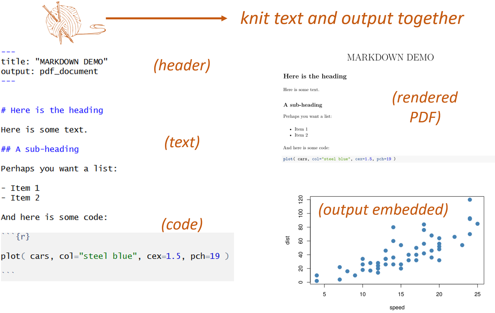
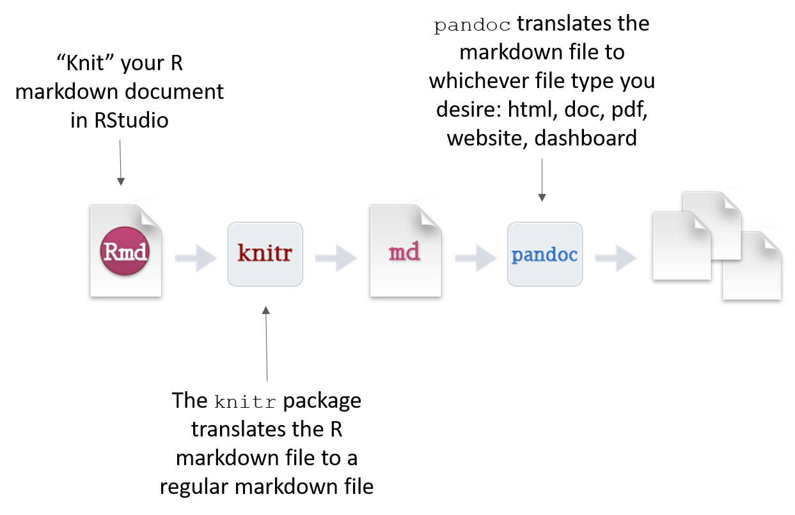

<br>

**CONTENTS**

-----------------------

* TOC
{:toc}

-----------------------

<br>
<br>

# What Are Data-Driven Docs?

Data-driven documents are formats that combine text and analysis (data+code). 

In doing so, they promote transparency and reproducability. For any given table, figure, or model in the document you should be able to easily discern how it was created, from what data, and what analysis was used. 

Popular formats include things like [R Markdown](https://rmarkdown.rstudio.com/lesson-1.html) documents and [Jupyter notebooks](https://jupyter.org/try).


<br>

------------
<br>

# How Do Data-Driven Docs Work?

All of the document formats build from a simple text formatting convention called [**markdown**](https://github.com/adam-p/markdown-here/wiki/Markdown-Cheatsheet). 

To create an R Markdown document, you need three things:

1. A header to specify the document type.  
2. Some text (formatted in markdown).  
3. Some code (inside a "code chunk").  

You can download a sample template [HERE](https://cdn.rawgit.com/DS4PS/Data-Science-Class/c464d527/TEMPLATES/MarkdownTemplateSimple.Rmd).

<br>



<br>
<br>

[](../gifs/NewRmarkdownFile/NewRmarkdownFile.html)

<br>

------------
<br>


# What is Markdown?

Markdown is a simple set of rules used to format text. It has been adopted broadly by the data science community and is used on GitHub, Stackoverflow, and now in R Studio. 

To give just a couple of examples of how it works:

**Unordered Lists**

```
* First item
* Second item
* Third item
    * First nested item
    * Second nested item
```
* First item
* Second item
* Third item
    * First nested item
    * Second nested item


**Hyperlinks**

Create links by wrapping the link text in square brackets [ ], and the URL in adjacent parentheses ( ). 

```
I find that [Google News](https://news.google.com) over-curates my media diet.
```

I find that [**Google News**](https://news.google.com) over-curates my media diet.

<br>


**Tables**

```
| Title 1          | Title 2          | 
|------------------|------------------|
| First entry      | Second entry     |  
| Third entry      | Fourth entry     |  
| Fifth entry      | Sixth entry      |
```

| Title 1          | Title 2          |  
|------------------|------------------|  
| First entry      | Second entry     |  
| Third entry      | Fourth entry     |  
| Fifth entry      | Sixth entry      |  


You can see a full list of **markdown rules** [HERE](https://ds4ps.org/data-driven-management-textbook/markdown/).

<br>

------------
<br>


# Knitting R Markdown Files

Code is placed inside of "chunks" in the documents:

[](../gifs/NewCodeChunk/NewCodeChunk.html)

When you "knit" a file R Studio will run all of code, embed the output into your document, and then convert the file to whichever type you have specified in the file header.  

<br> 




<br>

------------
<br>


# Output Types

You can select from many different document types, including HTML pages, Microsoft word, presentation formats, or dashboards.

<br>

<span style="display:block;text-align:center">

</span>


**Check out these examples:**

[R Markdown Formats](https://rmarkdown.rstudio.com/formats.html)  
[R Markdown Gallery](https://rmarkdown.rstudio.com/gallery.html)  

<br>

------------
<br>


### HTML Pages

```r
---
output: html_document
---
```

[](../gifs/html_format/html_format.html)

<br>

### Dashboards

```r
---
output: flexdashboard::flex_dashboard:
---
```

[](../gifs/DashboardExample/DashboardExample2.html)


[ [dashboard example](https://cultureofinsight.shinyapps.io/crypto_tracker/) ]  [ [source code](https://cultureofinsight.shinyapps.io/crypto_tracker/) ]  [ [blog about the tracker](https://www.cultureofinsight.com/blog/2018/01/22/2018-01-22-building-a-cryptocurrency-tracker-with-r/) ]  

<br>


### PDFs

```r
---
output: pdf_document
---
```

<br>

------------
<br>


# Installation

You will need the following programs to generate data-driven documents in R:

* Base R installation [CRAN](https://www.r-project.org/)
* R Studio [download page](https://www.rstudio.com/products/rstudio/download/#Installers)
* Pandoc ([comes with R Studio by default](https://blog.rstudio.com/2014/06/18/r-markdown-v2/))

When you first try to knit a file, you might get a message that you need the following packages:

* rmarkdown  
* knitr  

These can be installed in the usual manner:

```r
install.packages( "rmarkdown" )
install.packages( "knitr" )
```

**PDFs:**

If you would like to knit to PDF you need one additional program. TeX creates publication-quality PDF files. The open-source version is called MiKTeX [download page](http://miktex.org/download).

If you have problems, you can find some nice tutorials like this one: 
<https://www.reed.edu/data-at-reed/software/R/r_studio_pc.html>

**Specialized packages:**

Some document output formats require specific R packages. For example:

* journal templates  
* dashboards  
* r websites  
* books in bookdown  

You can find many of these packages on the [R Markdown templates page](https://rmarkdown.rstudio.com/formats.html).


<br>
<br>
<br>
<br>
<br>

--------------------


<br>
<br>

<span style="display:block;text-align:center">

</span>

<br>
<br>

----------------

<br>
<br>


<style>
p {
  margin-top:20px !important;
  margin-bottom:20px;
    }  
h6{
  font-size:calc(2em + 0.25vw) !important;
  color: #337ab7;
  font-weight:300;
  margin-top:60px !important;
  margin-bottom:20px;
  } 

#markdown-toc a {
  color: black;
  font-size:calc(0.75em + 0.25vw);
  line-height:1.2;
}  
#markdown-toc a:hover {
    color: black;
    text-decoration: none;
    font-weight: bold;
}
</style>
